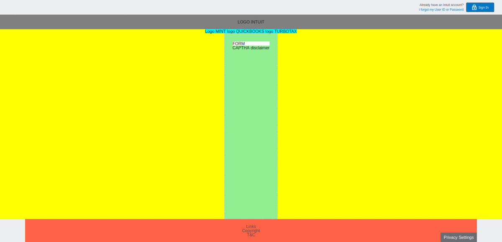
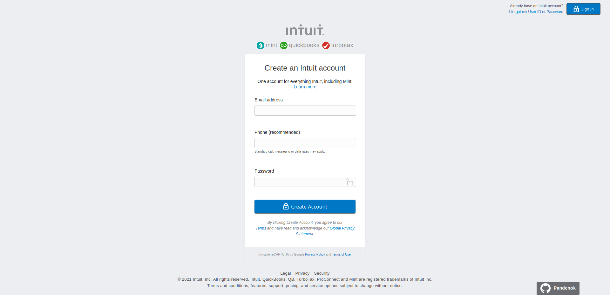

<!-- PROJECT LOGO -->

# Project: Intuit Sign Up Form

## What's this

This project was done as part of the [HTML and CSS](https://www.theodinproject.com/courses/html-and-css) course at [The Odin Project](https://www.theodinproject.com/). It involves building the form used by [Mint.com](https://accounts.intuit.com/signup.html?offering_id=Intuit.ifs.mint&namespace_id=50000026&redirect_url=https%3A%2F%2Fmint.intuit.com%2Foverview.event%3Ftask%3DS) for signing up new users. The full assignment can be found [here](https://www.theodinproject.com/courses/html-and-css/lessons/html-forms).

## Live Demo

The live demo is [here](https://pandenok.github.io/intuit-signup-form/). 

  
Click here if you wanna see work in progress

  

    
  

  

  

## Built With

- HTML
- CSS

## Show your support

Give a :star: if you like this project!